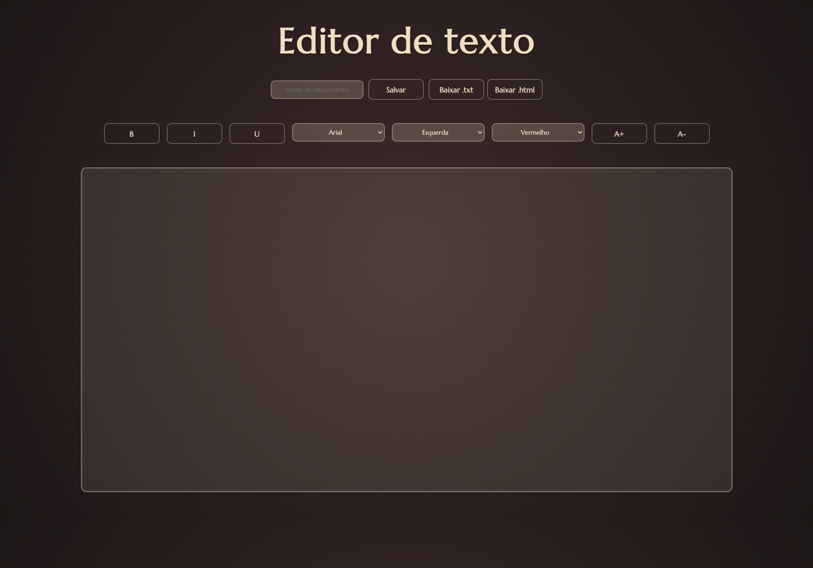

# ✍️ Editor de Texto Interativo
Este é um projeto de **Editor de Texto Interativo** desenvolvido utilizando **HTML**, **CSS**, e **JavaScript**. O editor oferece funcionalidades como formatação de texto (negrito, itálico, sublinhado), alteração de fontes, alinhamento, cor do texto e download do conteúdo em formatos `.txt` e `.html`.

---

## 🛠️ Funcionalidades
-**🖋️Formatação de texto:**
- **Negrito (B)**
- **Itálico (I)**
- **Sublinhado (U)**
- **🔤Alteração de Fonte:** Altere entre Arial e Times New Roman.
- **↔️Alinhamento do Texto:** Defina o alinhamento como esquerda, direita, centralizado, ou justificado.
- **🎨Cor do Texto:** Escolha entre as cores vermelho, verde ou azul.
- **💾Salvar e Baixar Arquivo:** O conteúdo do editor pode ser salvo em formatos .txt e .html.

## 🛠️ Tecnologias Utilizadas
- **HTML5**: Estrutura e conteúdo da página.
- **CSS3**: Estilos e layout responsivo para uma interface interativa.
- **JavaScript**: Funcionalidades para formatação de texto, alteração de fontes e cores, e gerenciamento de download.
- **Fontes**: Utilização da fonte *Marcellus* do Google Fonts para um design mais elegante.
- **Live Server**: Servidor local para visualização em tempo real durante o desenvolvimento.

## Como Rodar o Projeto
1. **Clone o repositório:**
   Se você ainda não tem o repositório em sua máquina, clone-o usando o seguinte comando no terminal:
   ```bash
   git clone https://github.com/seu-usuario/editor-de-texto.git
- **Abra o projeto no seu editor de código preferido (recomendado VS Code).**
- **Abra o arquivo index.html e clique com o botão direito para selecionar Open with Live Server.**
- **No navegador, você verá o editor de texto em funcionamento.**
